# Foxman Asset Gallery

This gallery is the visual evidence locker for the Foxman case study. It intentionally includes polished-looking assets, raw AI outputs, runtime sheets, packed atlases, and production leftovers so the reader can see the full pipeline rather than only the flattering pieces.

Statuses:

- **Source concept:** design exploration or style-lock evidence.
- **Raw generation:** AI output before cleanup or runtime preparation.
- **Runtime sheet:** processed image intended for direct or atlas-based game use.
- **Packed atlas:** runtime-optimized asset referenced by Phaser.
- **Production note:** documentation or prompt evidence.

---

# 1. Runtime Atlases

## Foxman Atlas

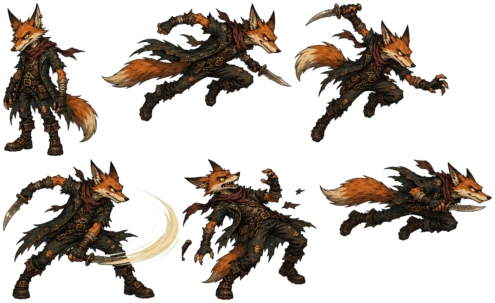

- Path: `assets/game/atlases/characters/foxman/foxman_atlas.png`
- Dimensions: `1274x780`
- Size: `194,096 bytes`
- Status: Packed atlas.
- Role: Player character frames for idle, run, jump, attack, hurt, and dash.
- Case-study note: Strong visual identity, but atlas frames alone do not solve animation feel, silhouette control, or input responsiveness.

## Drunken Guard Atlas

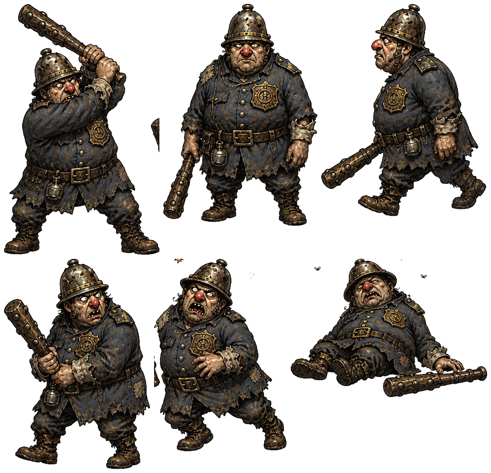

- Path: `assets/game/atlases/enemies/drunken_guard/drunken_guard_atlas.png`
- Dimensions: `1004x967`
- Size: `235,590 bytes`
- Status: Packed atlas.
- Role: First-room enemy.
- Case-study note: Good character design, but enemy readability depends on scale, animation states, timing, and encounter layout.

## Tax Clerk Atlas

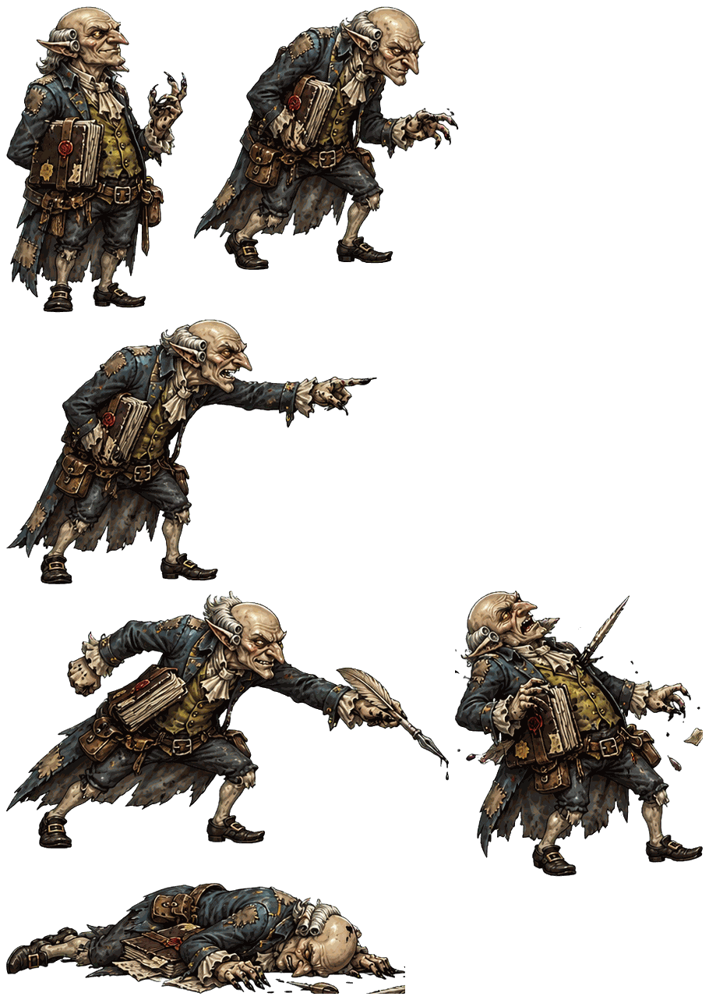

- Path: `assets/game/atlases/enemies/tax_clerk/tax_clerk_atlas.png`
- Dimensions: `910x1282`
- Size: `227,274 bytes`
- Status: Packed atlas.
- Role: Second-path enemy and elite-auditor base.
- Case-study note: Shows how one runtime asset was stretched into multiple gameplay roles.

## Toll Baron Atlas

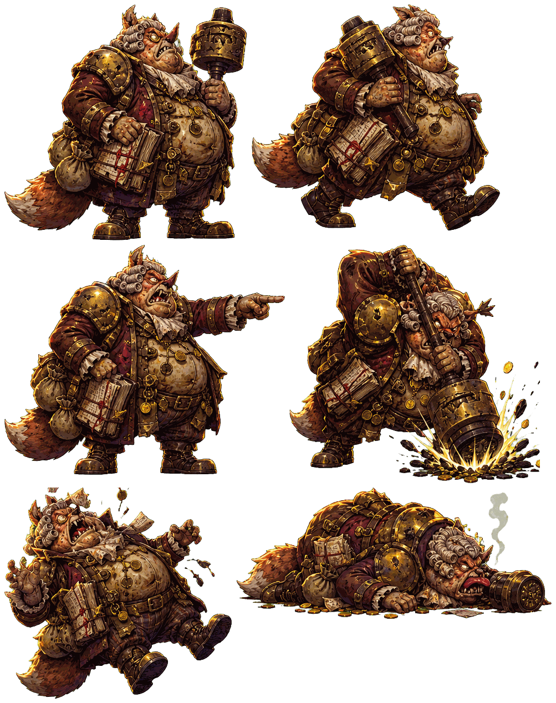

- Path: `assets/game/atlases/enemies/toll_baron/toll_baron_atlas.png`
- Dimensions: `1003x1269`
- Size: `405,208 bytes`
- Status: Packed atlas.
- Role: Mini-boss character art.
- Case-study note: One of the strongest assets visually; also proof that boss art does not automatically produce boss feel.

## Pickup And Exit Atlas

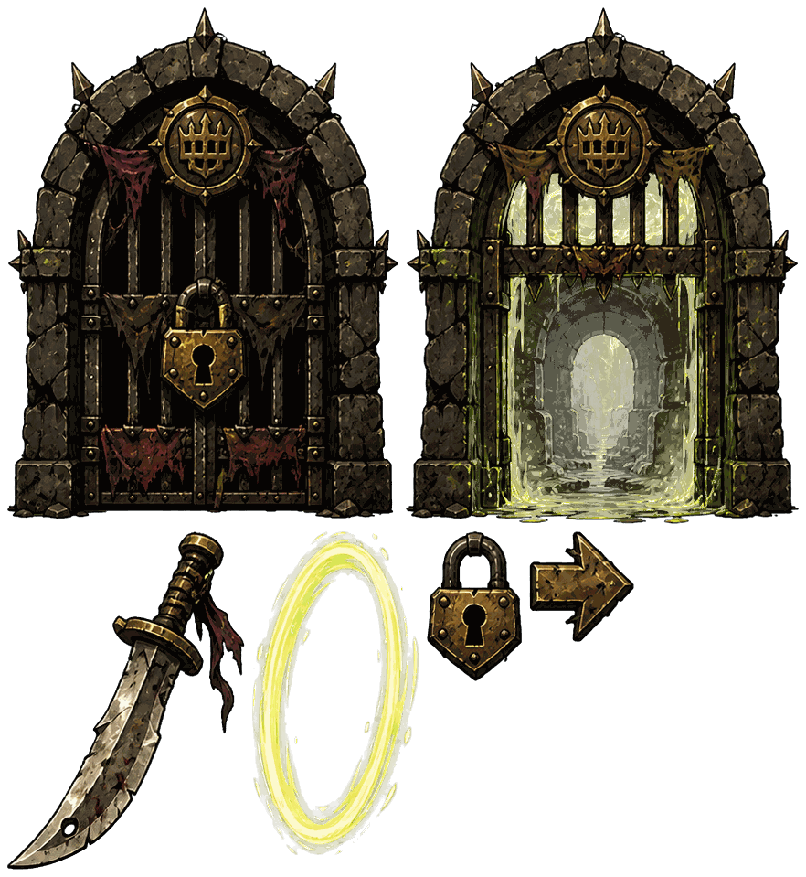

- Path: `assets/game/atlases/props/rotten_borough/pickup_exit_atlas.png`
- Dimensions: `882x959`
- Size: `216,529 bytes`
- Status: Packed atlas.
- Role: Locked gate, unlocked gate, Butcher Saber pickup, pickup ring, lock icon, exit arrow.
- Case-study note: The unlocked gate looked overpowering in the first-room presentation until scaled and toned down.

## Reward Shop Icons Atlas

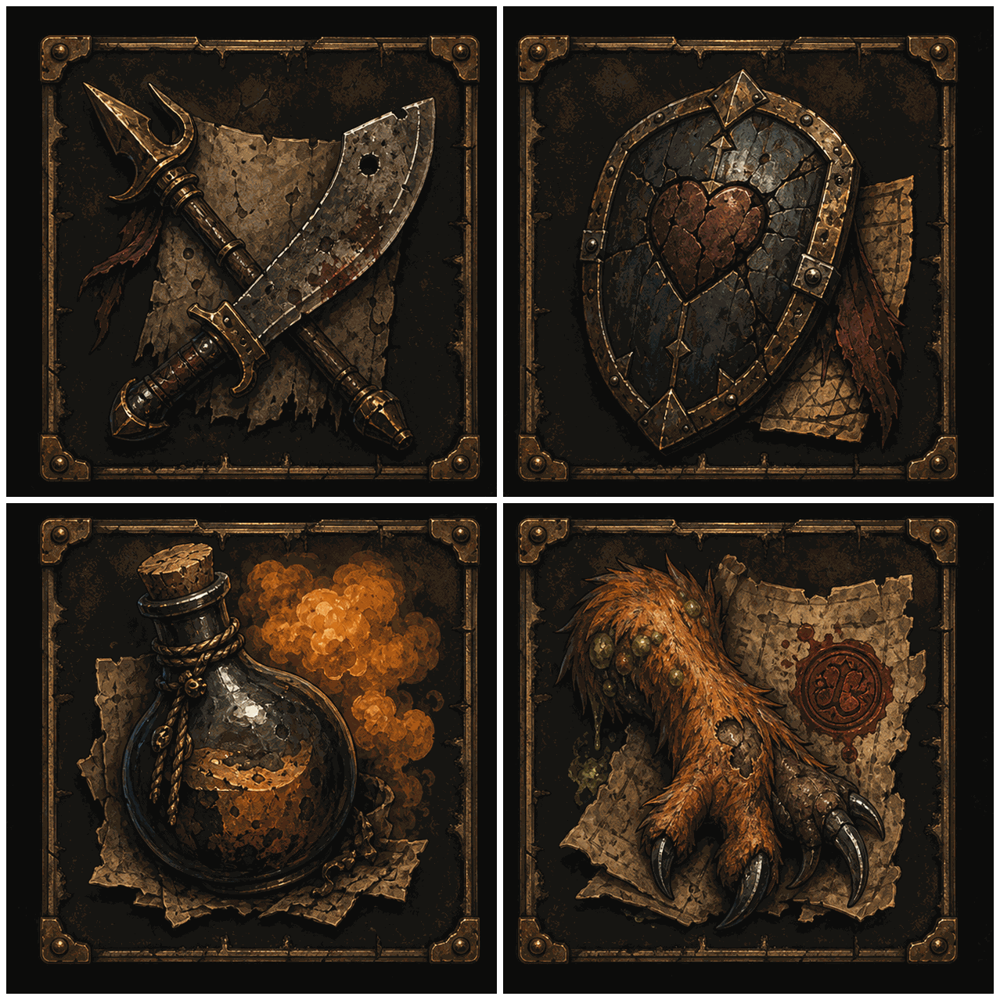

- Path: `assets/game/atlases/ui/reward_shop_icons/reward_shop_icons_atlas.png`
- Dimensions: `1278x1278`
- Size: `446,028 bytes`
- Status: Packed atlas.
- Role: Weapon, survival, skill, and mutation icons in the reward shop.
- Case-study note: Good example of useful UI asset generation, though the atlas is large for the amount of runtime UI value delivered.

---

# 2. Runtime Backgrounds And UI

## Rotten Borough Runtime Background

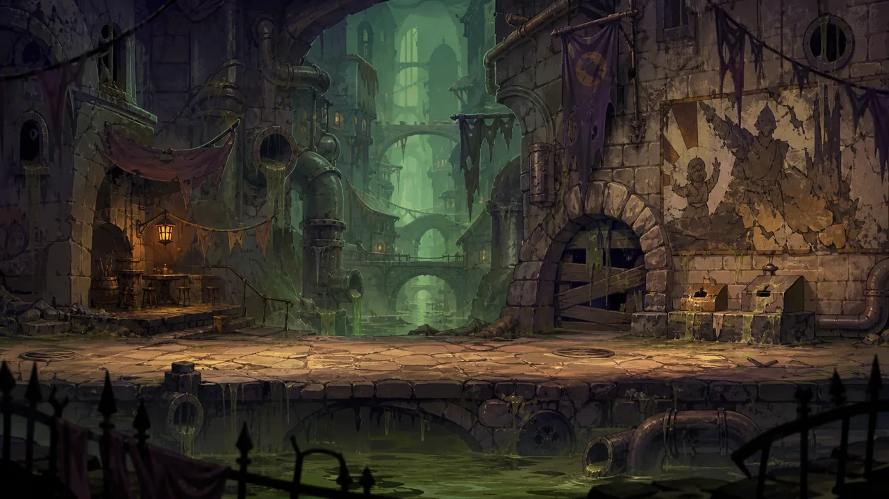

- Path: `assets/game/backgrounds/rotten_borough/bg_rotten_borough_mood_runtime.webp`
- Dimensions: `1280x720`
- Size: `118,038 bytes`
- Status: Runtime background.
- Role: First-room and title visual anchor.
- Case-study note: This image carried more of the game's perceived production value than many of the gameplay systems.

## Reward Shop Counter Runtime

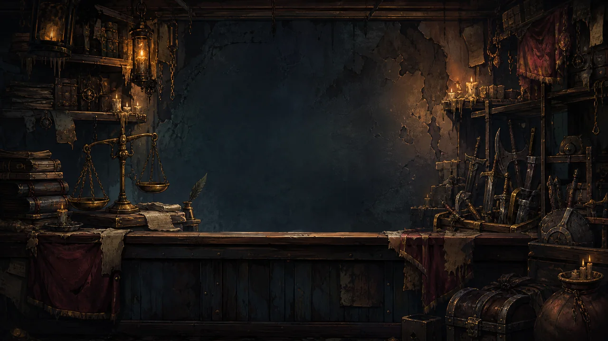

- Path: `assets/game/ui/menus/reward_shop_counter_runtime.webp`
- Dimensions: `1280x720`
- Size: `103,602 bytes`
- Status: Runtime UI/background.
- Role: Reward/shop scene presentation.
- Case-study note: Strong proof that a single good bitmap can make a screen feel more complete than its interaction depth actually is.

---

# 3. Runtime Sheets Before Packing

## Foxman Runtime Sheet

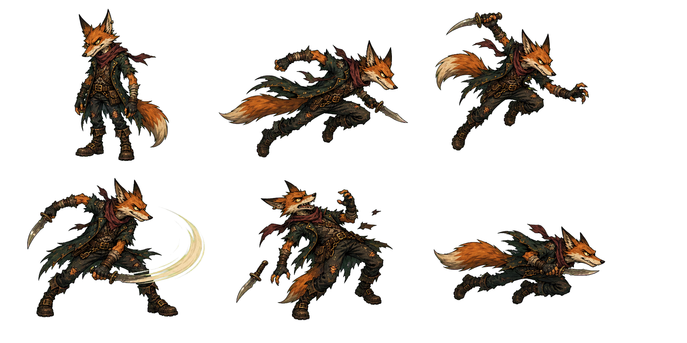

- Path: `assets/game/sprites/characters/foxman/char_foxman_candidate_b_prototype_sheet_alpha.png`
- Dimensions: `1774x887`
- Size: `961,066 bytes`
- Status: Runtime sheet.
- Role: Source sheet for the Foxman atlas.

## Drunken Guard Runtime Sheet

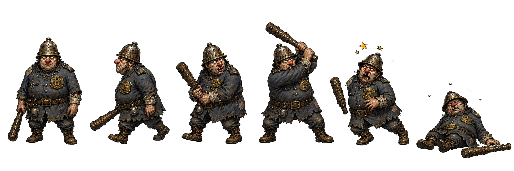

- Path: `assets/game/sprites/enemies/enemy_guard_drunken_runtime_sheet_alpha.png`
- Dimensions: `2172x724`
- Size: `1,162,884 bytes`
- Status: Runtime sheet.
- Role: Source sheet for the drunken guard atlas.

## Tax Clerk Runtime Sheet

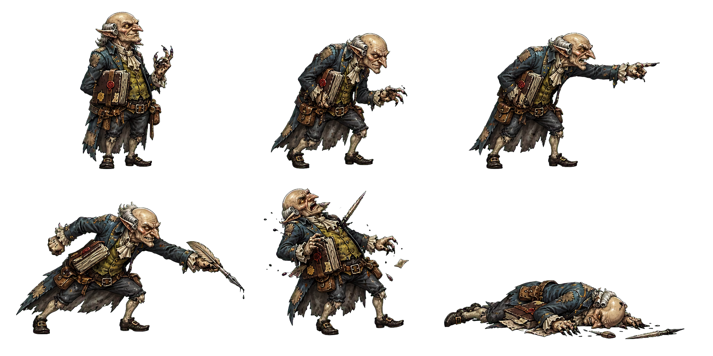

- Path: `assets/game/sprites/enemies/enemy_tax_clerk_runtime_sheet_alpha.png`
- Dimensions: `1774x887`
- Size: `1,032,968 bytes`
- Status: Runtime sheet.
- Role: Source sheet for tax clerk and elite auditor atlas.

## Toll Baron Runtime Sheet

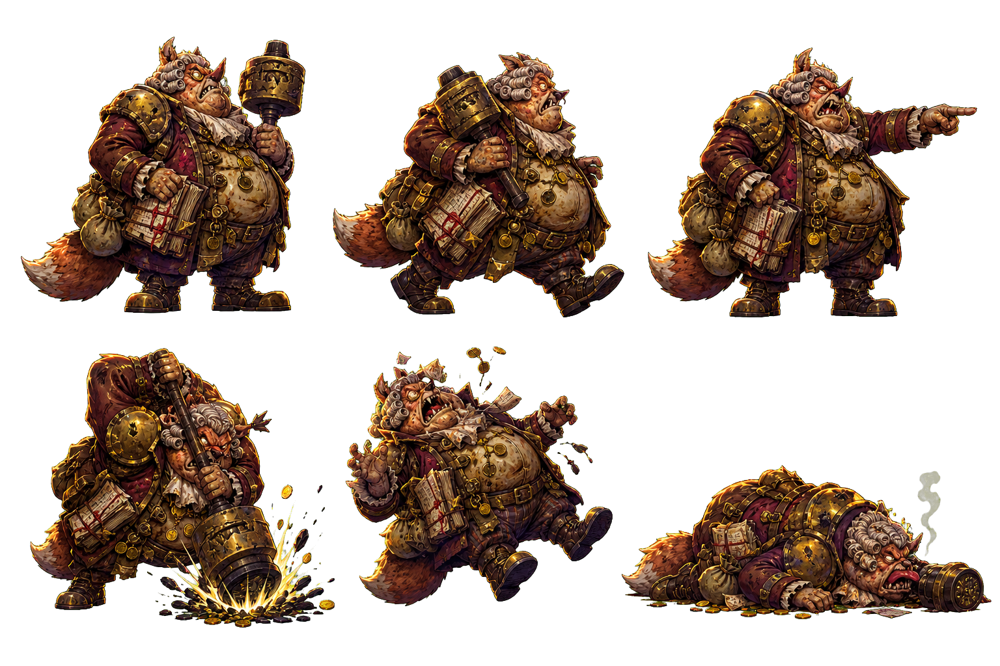

- Path: `assets/game/sprites/enemies/enemy_toll_baron_runtime_sheet_alpha.png`
- Dimensions: `1536x1024`
- Size: `1,818,552 bytes`
- Status: Runtime sheet.
- Role: Source sheet for Toll Baron atlas.

## Pickup/Exit Runtime Sheet

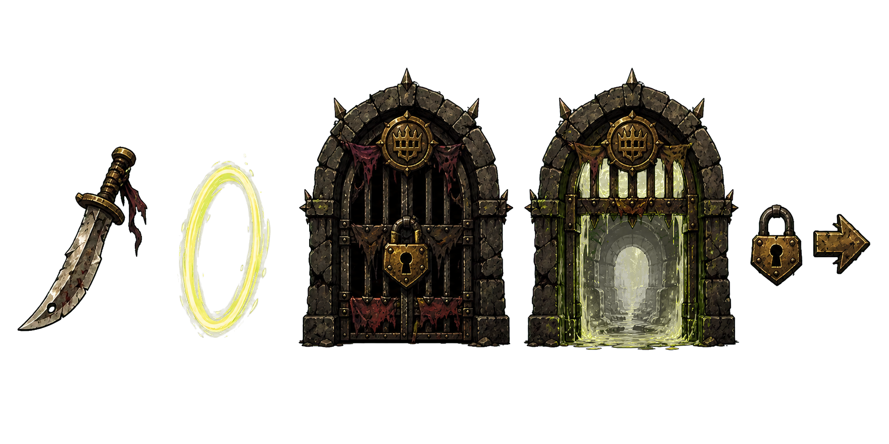

- Path: `assets/game/props/rotten_borough/prop_pickup_exit_runtime_sheet_alpha.png`
- Dimensions: `1774x887`
- Size: `1,111,434 bytes`
- Status: Runtime sheet.
- Role: Source sheet for pickup and gate props.

---

# 4. Source Concepts

## Rotten Borough Mood Concept

- Path: `assets/source/concepts/bg_rotten_borough_mood.png`
- Dimensions: `1774x887`
- Size: `2,273,506 bytes`
- Status: Source concept.
- Role: Biome mood, background direction, and environmental style anchor.

## Foxman Base Concept

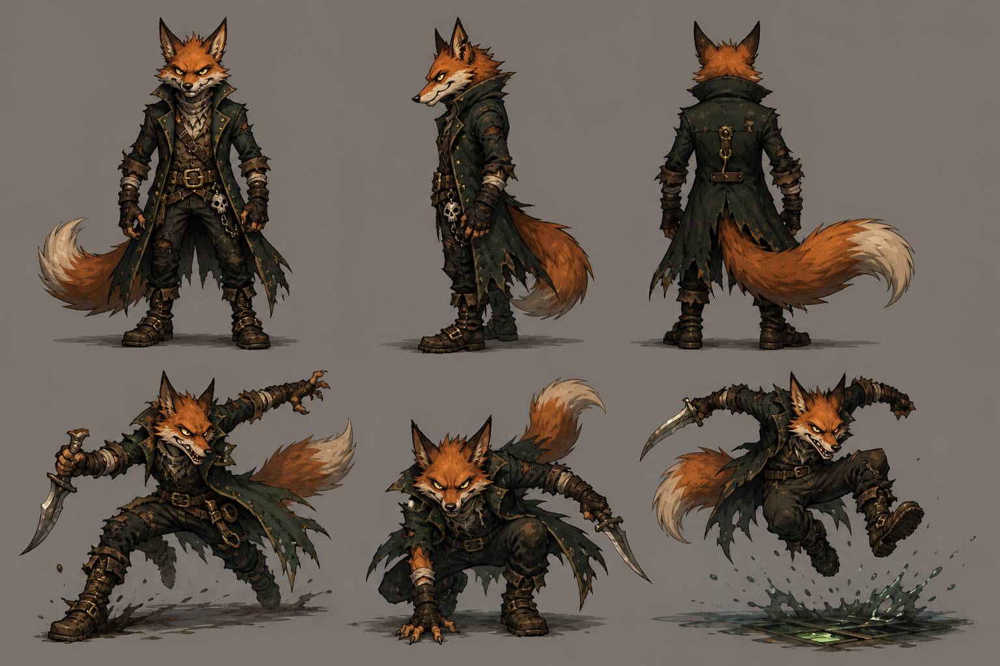

- Path: `assets/source/concepts/char_foxman_base_concept_sheet.png`
- Dimensions: `1536x1024`
- Size: `2,045,301 bytes`
- Status: Source concept.
- Role: Early protagonist exploration.

## Foxman Candidate B Concept

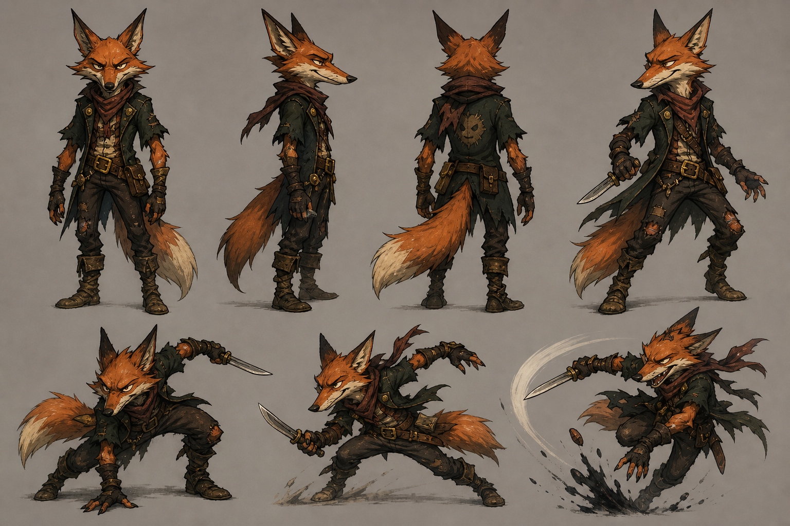

- Path: `assets/source/concepts/char_foxman_candidate_b_concept_sheet.png`
- Dimensions: `1536x1024`
- Size: `2,596,673 bytes`
- Status: Source concept.
- Role: Selected Foxman direction.

## Foxman Candidate C Concept

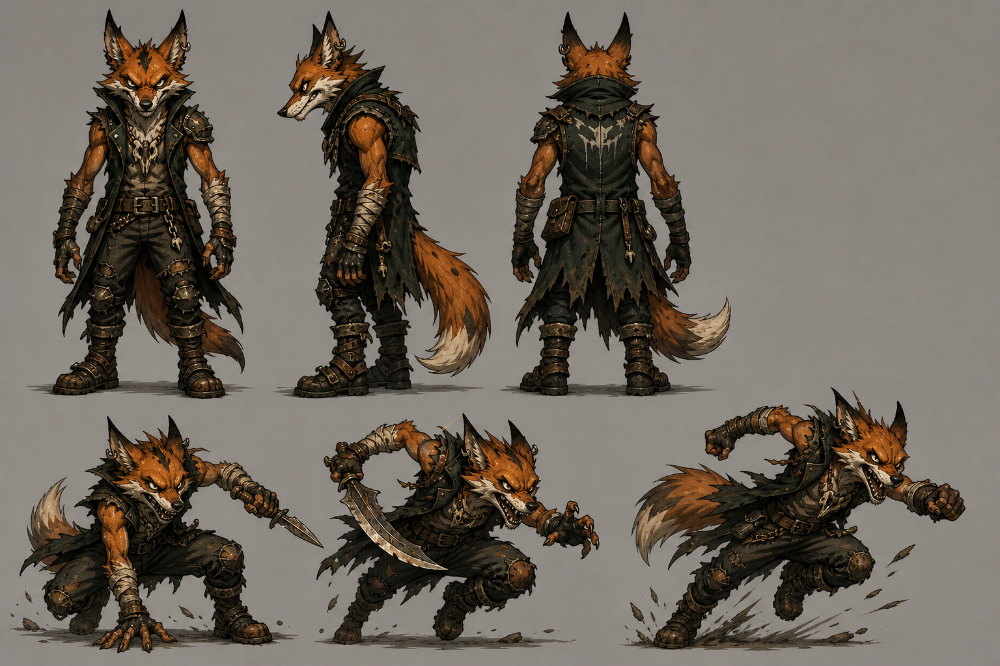

- Path: `assets/source/concepts/char_foxman_candidate_c_concept_sheet.png`
- Dimensions: `1536x1024`
- Size: `2,440,707 bytes`
- Status: Source concept.
- Role: Alternate Foxman direction.

## Drunken Guard Concept

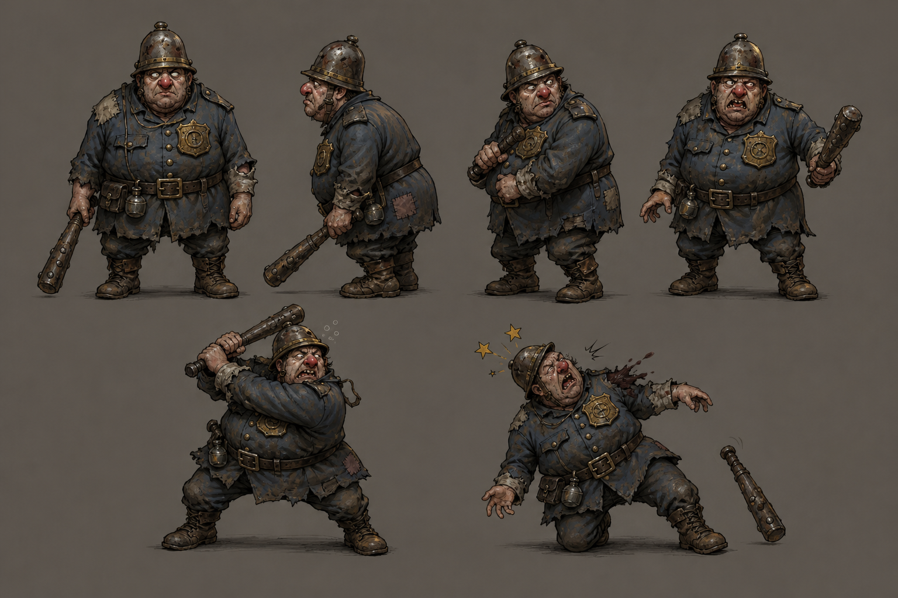

- Path: `assets/source/concepts/enemy_guard_drunken_concept_sheet.png`
- Dimensions: `1536x1024`
- Size: `2,134,235 bytes`
- Status: Source concept.
- Role: First enemy visual exploration.

## Sewer Rat Brute Concept

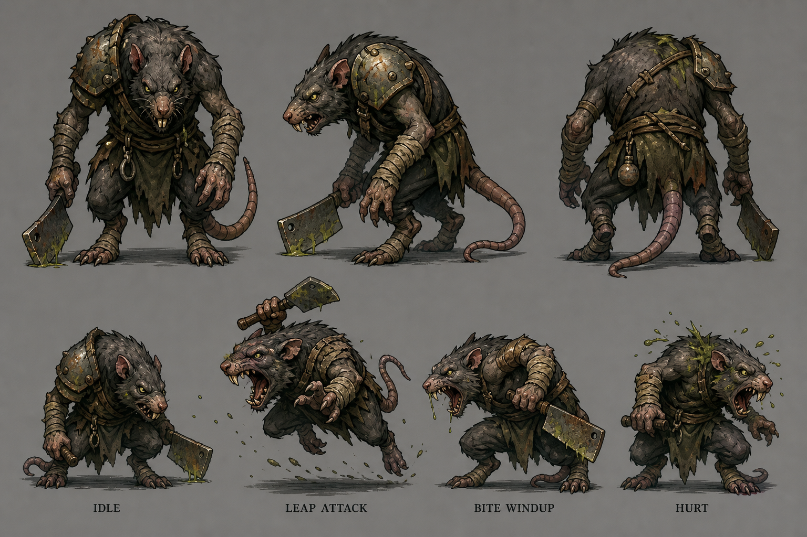

- Path: `assets/source/concepts/enemy_rat_sewer_brute_concept_sheet.png`
- Dimensions: `1536x1024`
- Size: `2,638,685 bytes`
- Status: Source concept.
- Role: Enemy concept that did not become part of the runtime slice.
- Case-study note: Useful evidence of cut-scope discipline and asset waste risk.

## Tax Clerk Concept

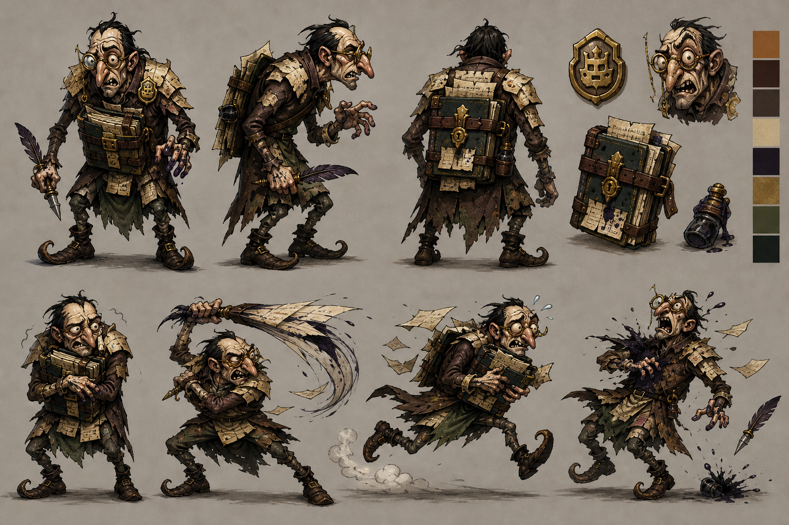

- Path: `assets/source/concepts/enemy_tax_clerk_concept_sheet.png`
- Dimensions: `1536x1024`
- Size: `3,029,912 bytes`
- Status: Source concept.
- Role: Bureaucratic enemy direction.

## Texture Material Board

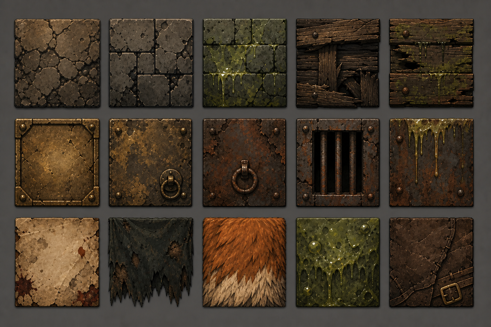

- Path: `assets/source/concepts/texture_rotten_borough_material_board.png`
- Dimensions: `1536x1024`
- Size: `2,721,781 bytes`
- Status: Source concept.
- Role: Material, palette, grime, and surface treatment direction.

## Rotten Borough Tile Concept

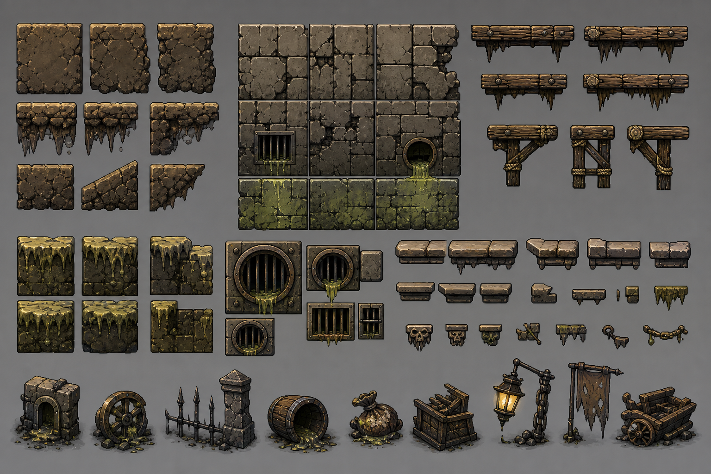

- Path: `assets/source/concepts/tile_rotten_borough_concept_sheet.png`
- Dimensions: `1536x1024`
- Size: `2,568,483 bytes`
- Status: Source concept.
- Role: Tile-kit direction.
- Case-study note: The runtime room still needs this converted into actual tile/platform assets.

## UI/VFX Style Board

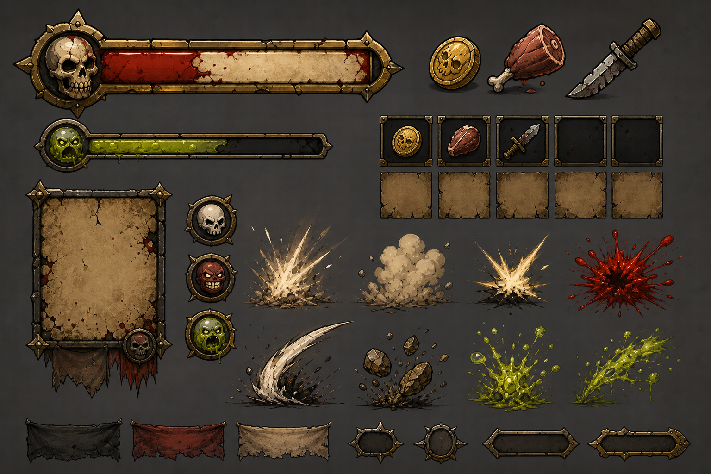

- Path: `assets/source/concepts/ui_vfx_style_board.png`
- Dimensions: `1536x1024`
- Size: `2,497,909 bytes`
- Status: Source concept.
- Role: UI and VFX tone exploration.

---

# 5. Raw AI Generations

The raw assets show the cost and mess of generation. They are useful in the case study because they prove the pipeline produced a lot of material quickly, and also that production requires selection and cleanup.

| Asset | Dimensions | Size | Role |
| --- | --- | ---: | --- |
| `assets/source/ai_raw/bg_rotten_borough_mood.png` | `1774x887` | `2,273,506` | Raw background/mood |
| `assets/source/ai_raw/char_foxman_base_concept_sheet.png` | `1536x1024` | `2,045,301` | Raw Foxman concept |
| `assets/source/ai_raw/char_foxman_candidate_b_concept_sheet.png` | `1536x1024` | `2,596,673` | Raw selected candidate |
| `assets/source/ai_raw/char_foxman_candidate_b_prototype_sheet_chroma.png` | `1774x887` | `1,675,003` | Raw chroma runtime sheet |
| `assets/source/ai_raw/char_foxman_candidate_c_concept_sheet.png` | `1536x1024` | `2,440,707` | Alternate concept |
| `assets/source/ai_raw/enemy_guard_drunken_concept_sheet.png` | `1536x1024` | `2,134,235` | Guard concept |
| `assets/source/ai_raw/enemy_guard_drunken_runtime_sheet_chroma.png` | `2172x724` | `1,764,179` | Guard runtime chroma sheet |
| `assets/source/ai_raw/enemy_rat_sewer_brute_concept_sheet.png` | `1536x1024` | `2,638,685` | Cut enemy concept |
| `assets/source/ai_raw/enemy_tax_clerk_concept_sheet.png` | `1536x1024` | `3,029,912` | Tax clerk concept |
| `assets/source/ai_raw/enemy_tax_clerk_runtime_sheet_chroma.png` | `1774x887` | `1,725,707` | Tax clerk runtime chroma sheet |
| `assets/source/ai_raw/enemy_toll_baron_runtime_sheet_chroma.png` | `1536x1024` | `2,475,767` | Toll Baron runtime chroma sheet |
| `assets/source/ai_raw/prop_pickup_exit_runtime_sheet_chroma.png` | `1774x887` | `1,631,939` | Props chroma sheet |
| `assets/source/ai_raw/reward_shop_counter_raw.png` | `1672x941` | `2,157,239` | Shop background raw |
| `assets/source/ai_raw/reward_shop_icon_board_raw.png` | `1254x1254` | `2,585,482` | Shop icon board raw |
| `assets/source/ai_raw/texture_rotten_borough_material_board.png` | `1536x1024` | `2,721,781` | Texture material board |
| `assets/source/ai_raw/tile_rotten_borough_concept_sheet.png` | `1536x1024` | `2,568,483` | Tile concept |
| `assets/source/ai_raw/ui_vfx_style_board.png` | `1536x1024` | `2,497,909` | UI/VFX style board |

---

# 6. Prompt And Art Direction Documents

| Document | Role |
| --- | --- |
| `assets/README.md` | Asset folder orientation |
| `assets/docs/art_direction.md` | Style direction |
| `assets/docs/animation_specs.md` | Animation expectations |
| `assets/docs/asset_log.md` | Asset production log |
| `assets/docs/import_notes.md` | Runtime import notes |
| `assets/docs/palette.md` | Palette direction |
| `assets/docs/qa_phase1_batch_001.md` | Phase 1 asset QA |
| `assets/docs/qa_phase6_asset_integration.md` | Integration QA |
| `assets/docs/style_lock_decision.md` | Foxman/style selection |
| `assets/source/prompts/README.md` | Prompt book index |
| `assets/source/prompts/foxman_concept.md` | Foxman base prompt |
| `assets/source/prompts/foxman_candidate_b.md` | Candidate B prompt |
| `assets/source/prompts/foxman_candidate_c.md` | Candidate C prompt |
| `assets/source/prompts/drunken_guard_concept.md` | Guard concept prompt |
| `assets/source/prompts/sewer_rat_brute_concept.md` | Cut enemy prompt |
| `assets/source/prompts/tax_clerk_concept.md` | Tax clerk concept prompt |
| `assets/source/prompts/tax_clerk_runtime_sheet.md` | Runtime sheet prompt |
| `assets/source/prompts/toll_baron_runtime_sheet.md` | Boss runtime prompt |
| `assets/source/prompts/rotten_borough_mood.md` | Biome background prompt |
| `assets/source/prompts/texture_material_board.md` | Texture/material prompt |
| `assets/source/prompts/tilekit_rotten_borough.md` | Tile-kit prompt |
| `assets/source/prompts/ui_vfx_style.md` | UI/VFX prompt |

---

# 7. Case-Study Visual Capture List

Images still worth capturing from the live build:

- Title screen.
- Manual first room start state.
- First room after cleanup.
- First-room completion.
- Reward shop.
- Second path with Tax Pike.
- Second path after elite defeated.
- Boss room start.
- Boss defeat.
- Death/restart state.
- Bad screenshot from user report, if preserved.
- Fixed wide screenshot after green-wash removal.

