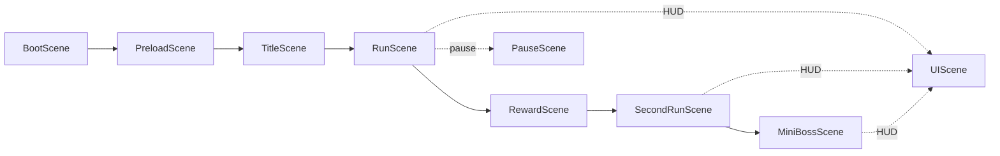

# Foxman Code Map

This document maps the working codebase for the Foxman case study. It is meant to show the bones: the shape of the product, the test harness, the asset pipeline, and where the one-shot run produced useful structure versus brittle scaffolding.

---

# 1. Top-Level Project Files

| File | Role |
| --- | --- |
| `PROJECT.md` | Current project truth and pickup guide. |
| `AGENTS.md` | Agent rules, gate discipline, and repo-specific behavior. |
| `package.json` | Scripts and dependencies. |
| `vite.config.ts` | Vite build config and Phaser vendor chunk split. |
| `tsconfig.json` | TypeScript config. |
| `index.html` | Browser entry document. |
| `.gitignore` | Ignore rules. |

---

# 2. Runtime Entry And Config

| File | Lines | Role |
| --- | ---: | --- |
| `src/main.ts` | 14 | Creates the Phaser game instance and mounts it into `#game-root`. |
| `src/style.css` | 29 | Fullscreen dark page/canvas styling. |
| `src/game/GameConfig.ts` | 44 | Phaser game dimensions, physics config, scale mode, and scene registration. |
| `src/game/assets.ts` | 69 | Runtime asset URLs and asset keys. |
| `src/game/assetFrames.ts` | 51 | Named frame/crop metadata for player, enemies, and props. |
| `src/game/smoke.ts` | 7 | Separates smoke scene routing from explicit `smokeAuto=1` bot control. |
| `src/vite-env.d.ts` | 18 | Vite/global debug typings. |

## Case-Study Note

This layer is a good artifact of agent production: the stack is simple, legible, and recoverable. The smoke split is also a useful example of a product bug created by conflating test routes and human-play routes.

---

# 3. Phaser Scene Map

| Scene File | Lines | Role |
| --- | ---: | --- |
| `src/game/scenes/BootScene.ts` | 11 | Initial boot hop into preload. |
| `src/game/scenes/PreloadScene.ts` | 73 | Loads all runtime assets and routes to title/smoke scenes. |
| `src/game/scenes/TitleScene.ts` | 52 | Title/start scene using Rotten Borough art. |
| `src/game/scenes/RunScene.ts` | 906 | First room: movement, pickup, guard, ranged prototype, skill prototype, completion, reward handoff. |
| `src/game/scenes/RewardScene.ts` | 138 | Reward/shop choice surface. |
| `src/game/scenes/SecondRunScene.ts` | 678 | Second combat path: tax clerk, elite auditor, reward/mutation/skill effects, boss door. |
| `src/game/scenes/MiniBossScene.ts` | 547 | Toll Baron mini-boss room, stamp special, death/restart. |
| `src/game/scenes/UIScene.ts` | 114 | HUD health, weapon, skill, route, and target display. |
| `src/game/scenes/PauseScene.ts` | 40 | Pause overlay. |

## Scene Flow

## Case-Study Note

The scene map looks like a real game slice. The failure was not absence of structure; it was that structure got ahead of feel and human-facing QA.

---

# 4. Gameplay Entities And Systems

| File | Lines | Role |
| --- | ---: | --- |
| `src/game/entities/Player.ts` | 147 | Player sprite, health, pose selection, damage, invulnerability, reset. |
| `src/game/entities/GuardEnemy.ts` | 249 | Shared enemy class for guard, tax clerk, elite auditor, and Toll Baron. |
| `src/game/entities/Pickup.ts` | 30 | Simple pickup debug state. |
| `src/game/movement/PlayerMotor.ts` | 104 | Horizontal acceleration, jump, gravity-facing movement state. |
| `src/game/input/InputMapper.ts` | 51 | Keyboard mapping for A/D, arrows, Space, J, K. |
| `src/game/combat/Health.ts` | 23 | Small health component. |
| `src/game/combat/WeaponStats.ts` | 58 | Weapon definitions and reward stat modifiers. |
| `src/game/skills/SkillStats.ts` | 19 | Active skill stats. |
| `src/game/mutations/MutationStats.ts` | 48 | Mutation query parsing and stat modifiers. |
| `src/game/rewards/RewardChoice.ts` | 85 | Reward/shop choice definitions and query helpers. |
| `src/game/levels/RoomObjective.ts` | 33 | First-room objective state. |
| `src/game/progression/ProgressStore.ts` | 68 | Local storage deaths, kills, and unlocks. |
| `src/game/dialogue/BarkDeck.ts` | 38 | Bark cooldown and trigger lines. |
| `src/game/audio/AudioBus.ts` | 23 | Audio cue placeholder/debug state. |
| `src/game/feedback/HitFeedback.ts` | 46 | Floating hit text and spark feedback. |
| `src/game/data/movement.ts` | 9 | Movement tuning constants. |

## Case-Study Note

The systems are intentionally small and readable, which is a strength. The weakness is that many of them are prototypes masquerading as finished game feel.

---

# 5. Asset Pipeline Scripts

| File | Lines | Role |
| --- | ---: | --- |
| `scripts/export-frame-atlas.py` | 138 | Crops source sheets into named Phaser atlas PNG/JSON pairs. |
| `scripts/export-runtime-background.py` | 34 | Converts source background into optimized runtime WebP. |

## Generated Atlas Specs

| Spec | Role |
| --- | --- |
| `assets/game/atlases/characters/foxman/atlas-spec.json` | Foxman frame export spec. |
| `assets/game/atlases/enemies/drunken_guard/atlas-spec.json` | Drunken guard frame export spec. |
| `assets/game/atlases/enemies/tax_clerk/atlas-spec.json` | Tax clerk frame export spec. |
| `assets/game/atlases/enemies/toll_baron/atlas-spec.json` | Toll Baron frame export spec. |
| `assets/game/atlases/props/rotten_borough/atlas-spec.json` | Props and gate export spec. |
| `assets/game/atlases/ui/reward_shop_icons/atlas-spec.json` | Reward icon export spec. |

## Case-Study Note

This is one of the most reusable pieces of the run: a repeatable asset pipeline was created rather than only dumping images into the repo.

---

# 6. Test And Smoke Harness

| File | Lines | Role |
| --- | ---: | --- |
| `tests/unit/asset-keys.test.ts` | 275 | Unit coverage for asset keys, atlas exports, objective state, and audio cues. |
| `tests/smoke/check-dist.mjs` | 17 | Production build artifact smoke check. |
| `tests/smoke/check-browser-routes.mjs` | 1066 | Headless Chrome DevTools route matrix covering title, room, reward, second path, boss, death/restart, and visual green-artifact guard. |

## Smoke Route Contract

Manual/debug scene links:

- `/?smoke=room`
- `/?smoke=reward`
- `/?smoke=second&reward=pikeReach`
- `/?smoke=boss`

Automated bot-control links:

- `/?smokeAuto=1&smoke=room`
- `/?smokeAuto=1&smoke=fullSlice`
- `/?smokeAuto=1&smoke=rewardSkillBoss`

## Case-Study Note

The smoke harness is both a success and a warning. It gave broad confidence in route state, but initially hid human-play failure because the bot route was presented as a playable link.

---

# 7. Documentation And Project Brain

## Core Docs

| File | Role |
| --- | --- |
| `docs/FOXMANS_INITIATIVE.md` | Master production plan, gates, scope, pillars. |
| `docs/06-decisions/0001-web-phaser-stack.md` | ADR for Vite/TypeScript/Phaser stack. |
| `docs/07-ops/OPERATING-MANUAL.md` | Agentic project-brain usage. |
| `docs/07-ops/PROMPT-TEMPLATE.md` | Reusable agent prompt templates. |
| `docs/07-ops/SKILLS.md` | Project skill index. |
| `docs/07-ops/NEXT-IN-HOPPER.md` | Active queue. |
| `docs/07-ops/FUTURE-TODO.md` | Parked backlog. |
| `docs/07-ops/COMPLETED.md` | Completed work log. |
| `docs/07-ops/SHIPPING-UPDATE-SKILL.md` | Ops update procedure. |

## Phase Reports

| Report | Case-Study Role |
| --- | --- |
| `docs/PHASE2_ENGINE_SCAFFOLD_REPORT.md` | Engine boot evidence. |
| `docs/PHASE3_MOVEMENT_SANDBOX_REPORT.md` | Movement sandbox evidence. |
| `docs/PHASE4_COMBAT_SANDBOX_REPORT.md` | Combat sandbox evidence. |
| `docs/PHASE5_VERTICAL_SLICE_ROOM_REPORT.md` | First room evidence. |
| `docs/PHASE6_ASSET_INTEGRATION_REPORT.md` | First runtime art integration. |
| `docs/PHASE7A_POLISH_FEEDBACK_REPORT.md` | Hit stop, knockback, completion feedback. |
| `docs/PHASE7_VERTICAL_SLICE_POLISH_REPORT.md` | Title, pause, barks. |
| `docs/PHASE8_FOUNDATION_REPORT.md` | Extended-slice setup. |
| `docs/PHASE8_SECOND_PATH_REPORT.md` | Second combat path. |
| `docs/PHASE8_TAX_CLERK_ART_AND_BROWSER_SMOKE_REPORT.md` | Tax clerk art and browser smoke. |
| `docs/PHASE8_REWARD_CHOICE_AND_ELITE_REPORT.md` | Reward choices and elite prototype. |
| `docs/PHASE8_MINIBOSS_ROOM_REPORT.md` | Boss scene prototype. |
| `docs/PHASE8_TOLL_BARON_ART_AND_BEHAVIOR_REPORT.md` | Boss art and special behavior. |
| `docs/PHASE8_ATLAS_PACKING_REPORT.md` | Atlas pipeline evidence. |
| `docs/PHASE8_FAIL_STATE_REPORT.md` | Death/restart evidence. |
| `docs/PHASE8_CONNECTED_BOSS_ROUTE_REPORT.md` | Connected second-path-to-boss route. |
| `docs/PHASE8_SECOND_PATH_DAMAGE_REPORT.md` | Second-path damage/restart coverage. |
| `docs/PHASE8_TAX_CLERK_ATLAS_REPORT.md` | Tax clerk atlas migration. |
| `docs/PHASE8_GUARD_ATLAS_REPORT.md` | Guard atlas migration. |
| `docs/PHASE8_PROP_ATLAS_REPORT.md` | Prop atlas migration. |
| `docs/PHASE8_FOXMAN_ATLAS_REPORT.md` | Player atlas migration. |
| `docs/PHASE8_BACKGROUND_OPTIMIZATION_REPORT.md` | Background optimization. |
| `docs/PHASE8_RANGED_COMBAT_REPORT.md` | Ranged weapon prototype. |
| `docs/PHASE8_SKILL_PROTOTYPE_REPORT.md` | Active skill prototype. |
| `docs/PHASE8_MUTATION_PROTOTYPES_REPORT.md` | Mutation prototypes. |
| `docs/PHASE8_REWARD_SHOP_SURFACE_REPORT.md` | Reward/shop choice surface. |
| `docs/PHASE8_REWARD_SHOP_ART_REPORT.md` | Reward/shop art. |
| `docs/PHASE8_REWARD_SHOP_ICON_REPORT.md` | Reward/shop icon atlas. |
| `docs/PHASE8_ROUTE_COHESION_REPORT.md` | Full-slice route cohesion. |
| `docs/PHASE8_CARRIED_SKILL_AND_SELECTION_REPORT.md` | Carried skill usability. |
| `docs/PHASE8_BOSS_BUILD_VARIETY_REPORT.md` | Skill boss route and boss variety. |
| `docs/PHASE8_COMBAT_HUD_READABILITY_REPORT.md` | HUD readability pass. |
| `docs/PHASE8_COMBAT_VFX_HIT_FEEDBACK_REPORT.md` | Hit feedback pass. |
| `docs/PHASE8_V1_STABILIZATION_REPORT.md` | Build-size stabilization. |
| `docs/PHASE8_V1_ACCEPTANCE_AUDIT.md` | Evidence map and over-generous V1 acceptance. |

---

# 8. File Ownership By Product Area

## Player Feel

- `src/game/entities/Player.ts`
- `src/game/movement/PlayerMotor.ts`
- `src/game/data/movement.ts`
- `src/game/input/InputMapper.ts`

## Combat

- `src/game/combat/Health.ts`
- `src/game/combat/WeaponStats.ts`
- `src/game/entities/GuardEnemy.ts`
- `src/game/feedback/HitFeedback.ts`
- `src/game/scenes/RunScene.ts`
- `src/game/scenes/SecondRunScene.ts`
- `src/game/scenes/MiniBossScene.ts`

## Progression And Rewards

- `src/game/rewards/RewardChoice.ts`
- `src/game/mutations/MutationStats.ts`
- `src/game/skills/SkillStats.ts`
- `src/game/progression/ProgressStore.ts`
- `src/game/scenes/RewardScene.ts`

## Presentation

- `src/game/assets.ts`
- `src/game/assetFrames.ts`
- `src/game/scenes/TitleScene.ts`
- `src/game/scenes/UIScene.ts`
- `src/game/scenes/PauseScene.ts`
- `assets/game/**`

## Testing

- `tests/unit/asset-keys.test.ts`
- `tests/smoke/check-dist.mjs`
- `tests/smoke/check-browser-routes.mjs`
- `src/game/smoke.ts`

---

# 9. Risk Map

## Strong Bones

- Clear scene graph.
- Project-local assets.
- Repeatable atlas export.
- Broad smoke matrix.
- Modular gameplay classes.
- Written project brain.

## Weak Bones

- `RunScene`, `SecondRunScene`, and `MiniBossScene` are too large.
- Player feel is not yet at the quality bar implied by the pitch.
- First-room layout is still prototype-quality.
- Visual polish was accepted too early.
- Automated smoke initially overrode human controls.
- V1 label was too optimistic.

## Case-Study Lesson

The project has enough structure to prove agentic production can create real scaffolding. It also has enough failure to prove scaffolding should not be mistaken for product.

