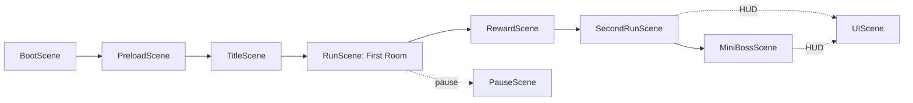
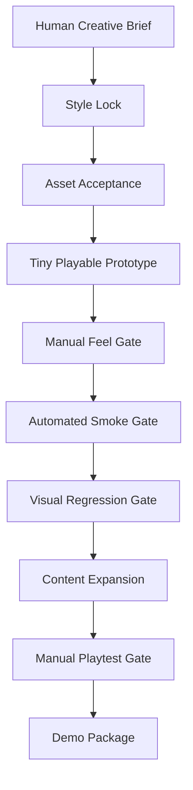

```mermaid
flowchart LR
  Plan["Phase 0: Plan"] --> Style["Phase 1: Style Lock"]
  Style --> Engine["Phase 2: Engine Boot"]
  Engine --> Move["Phase 3: Movement"]
  Move --> Combat["Phase 4: Combat"]
  Combat --> Room["Phase 5: First Room"]
  Room --> Art["Phase 6: Asset Integration"]
  Art --> Polish["Phase 7: Polish"]
  Polish --> Extend["Phase 8: Extended Slice"]
  Extend --> Audit["V1 Acceptance Audit"]
  Audit --> Human["Human Playtest Reality Check"]
  Human --> Rehab["Playable Rehab Fixes"]
```

# Foxman Case Study

# Foxman: A Merciless Bastard, And The Failure Mode Of One-Shot Game Generation

## Document Intent

This is the master structure for a full visual case study of `The Adventures of Foxman, a Merciless Bastard`.

The case study should not pretend the one-shot run produced a finished game. It should show the whole machine: the ambition, the art, the code, the gates, the smoke tests, the failure modes, the recovery patches, and the business lesson.

Core thesis:

> One-shot generation can produce assets, scaffolds, and plausible systems quickly, but it does not reliably produce a coherent product without orchestration, taste, manual playtesting, and explicit quality gates.

Supporting docs:

- [Asset Gallery](ASSET_GALLERY.md)
- [Code Map](CODE_MAP.md)

---

# 1. Cover

## Purpose

Establish the case-study tone immediately: stylish, candid, visual, and slightly nasty in a way that matches Foxman.

## Required Visuals

- Hero image: best Foxman concept or best fixed gameplay screenshot.
- Secondary strip: Rotten Borough background, Foxman atlas, Toll Baron atlas, bad green-wash screenshot, fixed first-room screenshot.

## Copy Blocks

Title:

`Foxman: A Merciless Bastard, And The Failure Mode Of One-Shot Game Generation`

Subtitle:

`A case study in AI game production, agent orchestration, smoke-test mirages, and why playable is a human word.`

Opening line:

> Foxman was supposed to prove a game could be one-shot generated. Instead, the merciless bastard exposed the real lesson: generation is cheap; orchestration is the product.

---

# 2. Executive Summary

## Purpose

Give product leaders, founders, engineers, and creative directors a two-minute read.

## Content

- What was attempted:
  A Dead Cells-inspired 2D side-scroller with AI-generated characters, textures, backgrounds, sprite sheets, Phaser code, gates, and smoke tests.
- What was produced:
  A runnable TypeScript/Phaser vertical-slice scaffold with generated art, multiple combat scenes, reward choices, a boss prototype, persistence, and browser smoke coverage.
- What failed:
  The human play experience. The first shared playable link was a bot-driven smoke route, presentation still looked like debug scaffolding, and V1 was declared too early.
- What was learned:
  Agent orchestration is not optional production overhead. It is the difference between artifacts and product.
- Why it matters:
  AI lowers generation cost while raising the value of direction, taste, integration, QA, and human-in-the-loop review.

## Required Evidence

- Link to smoke matrix output.
- Link to manual-control fix entry.
- Link to V1 acceptance audit as a cautionary artifact.

---

# 3. Original Ambition

## Purpose

Show the scope of the initial challenge so the failure is framed fairly. This was not a request for a toy prototype. It was a request for a full one-go production run with assets, code, testing, gates, and a big game tone.

## Include

- Original brief excerpt.
- Game title.
- Tone target.
- Protagonist description.
- Planned stack.
- Gate-based production expectation.

## Visuals

- Foxman concept sheets.
- Rotten Borough mood image.
- UI/VFX style board.
- Texture/material board.

## Narrative Point

The prompt asked for ambition, but ambition is not a substitute for production control.

---

# 4. Production Timeline

## Purpose

Show the whole project from start to finish, including the parts that worked.

## Timeline Structure

1. Phase 0 - Initiative planning.
2. Phase 1 - Style lock and first asset generation.
3. Phase 2 - Vite/TypeScript/Phaser scaffold.
4. Phase 3 - Movement sandbox.
5. Phase 4 - Combat sandbox.
6. Phase 5 - First room.
7. Phase 6 - Asset integration.
8. Phase 7 - Title, pause, barks, polish.
9. Phase 8A - Second path and reward room.
10. Phase 8B - Runtime atlases and background optimization.
11. Phase 8C - Ranged weapon, active skill, mutations.
12. Phase 8D - Toll Baron mini-boss.
13. Phase 8E - HUD/readability, hit feedback, smoke matrix.
14. V1 acceptance audit.
15. Human playtest backlash.
16. Recovery fixes: visual cleanup and manual-play-safe smoke links.

## Required Visuals

- Timeline diagram.
- One screenshot or asset per phase where available.
- Phase report links.

## Mermaid Draft

---

# 5. Asset Gallery

## Purpose

Show off the bones. The gallery should be rich enough that someone can understand the visual production pipeline without opening the repo.

## Asset Groups

- Source concepts.
- Raw AI generations.
- Runtime character sheets.
- Packed atlases.
- Backgrounds.
- Props.
- UI and reward art.
- Prompt docs and art-direction docs.

## Gallery Rule

Every meaningful image should appear with:

- thumbnail/image embed
- path
- dimensions
- production role
- status
- what worked
- what failed or remains rough

Canonical source:

- [Asset Gallery](ASSET_GALLERY.md)

---

# 6. The Playable Build

## Purpose

Explain what the code actually does.

## Include

- Vite + TypeScript + Phaser 3.
- Scene list.
- Player movement.
- Enemy combat.
- Rewards/shop.
- Second path.
- Toll Baron boss.
- HUD.
- Persistence.
- Smoke harness.

## Scene Flow

## Code Source

- [Code Map](CODE_MAP.md)

---

# 7. The Looks-Done Trap

## Purpose

This is the first major lesson section. It should show how generated assets and passing tests can create false confidence.

## Case Evidence

- The build booted.
- Browser smoke passed.
- Assets existed.
- Reports existed.
- V1 was accepted.
- But the first human-facing link was bot-controlled.
- The room-complete flash washed the scene in green.
- Placeholder geometry still looked like debug scaffolding.

## Required Visuals

- Bad first-room screenshot.
- Fixed first-room screenshot.
- Visual annotation callouts.

## Key Line

> A smoke test can prove a route completes. It cannot prove the player wants to keep touching the game.

---

# 8. What One-Shot Generation Got Right

## Purpose

Keep the analysis honest. This is not an anti-AI rant.

## Wins

- Fast production of concept art and runtime art.
- Fast scaffold creation.
- Scene structure emerged quickly.
- Smoke matrix became broad.
- Generated assets were project-local and integrated into code.
- Browser smoke caught many behavioral regressions.
- The repo became a usable project brain with reports and operating docs.

## Business Lesson

AI is excellent at producing material and momentum. That is valuable. The mistake is confusing material and momentum for product readiness.

---

# 9. What One-Shot Generation Got Wrong

## Purpose

Name the production failures directly.

## Failures

- The human-first playable link was not protected.
- The system optimized for test pass states over touch quality.
- Visual integration lagged behind asset generation.
- Milestone language became too flattering.
- Smoke tests lacked enough visual and manual-play assertions.
- The level did not receive enough layout/game-feel direction.
- The project had many features before it had a truly convincing first minute.

## Key Line

> One-shot generation is good at producing an answer-shaped object. Games require a feel-shaped object.

---

# 10. Agent Orchestration Is A Skill

## Purpose

Make the business argument.

## Argument

Agent orchestration is not just writing a longer prompt. It is the discipline of converting a vague, high-ambition goal into an ordered production system that protects quality.

## Orchestration Skills

- Scope control.
- Gate design.
- Context management.
- Delegation.
- Taste enforcement.
- Manual QA.
- Automated QA.
- Asset acceptance.
- Naming and doc discipline.
- Knowing when a milestone label is lying.

## Key Line

> Agents are force multipliers, not product owners. Without orchestration, they optimize for local completion signals while the global experience quietly rots.

---

# 11. Foxman Failure Modes

## Purpose

Create a reusable taxonomy.

## Taxonomy

### The Scaffold Mirage

The repo has scenes, entities, tests, docs, and assets, so it feels like a game exists. But the experience is still a scaffold.

### The Smoke-Test Lie

Automation proves state transitions. It does not prove a human can or should play.

### The Asset Dump Problem

Beautiful images do not become game art until they are composed, scaled, framed, animated, and tested in motion.

### The V1 Delusion

Declaring an internal technical slice as a demo candidate creates false confidence.

### The Context Avalanche

Huge goals produce many local wins and make it harder to see whether the core thing is good.

### The Taste Gap

Agents can obey instructions while missing the embarrassment-level failure a human sees in two seconds.

---

# 12. Business Story

## Purpose

Translate the postmortem into strategic value.

## Audience

- AI founders.
- Game studio leads.
- Product managers.
- Engineering managers.
- Creative directors.
- Investors evaluating AI production claims.

## Business Argument

AI generation changes the cost curve of production, but it does not remove production management. It shifts bottlenecks from raw creation to selection, integration, orchestration, QA, and taste.

## Commercial Takeaways

- AI can make early exploration dramatically cheaper.
- AI can create convincing raw material fast.
- AI can generate testable scaffolds fast.
- AI also creates hidden review debt.
- Teams need stronger gates, not weaker ones.
- The valuable role is not "prompt writer"; it is AI production director.

## Suggested Framing

> The future is not one-shot product generation. The future is agentic production systems operated by people with taste.

---

# 13. Token Economics

## Purpose

Make the scale of the run concrete. The Foxman experiment was not just creatively expensive; it was token-expensive. The cost story matters because one-shot generation is often sold as cheap automation, while real agentic production burns tokens through planning, asset iteration, code generation, smoke testing, debugging, documentation, and recovery work.

## Run Token Count

Working case-study token count:

`5,300,000 tokens`

This figure should be presented as the project accounting number for the run unless a more precise platform export is later attached. The important case-study point is not false precision; it is order of magnitude. Foxman consumed millions of tokens and still required human judgment to identify obvious product failures.

## GPT-5.5 API Pricing Reference

OpenAI's GPT-5.5 launch/pricing note states that `gpt-5.5` API pricing is:

- `$5 per 1M input tokens`
- `$30 per 1M output tokens`
- Batch and Flex pricing at half the standard API rate
- Priority/Fast pricing at `2.5x` the standard API rate

Source: [Introducing GPT-5.5, Availability and pricing](https://openai.com/index/introducing-gpt-5-5/)

## Standard API Cost Scenarios For 5.3M Tokens

Because total tokens are not enough to calculate an exact API bill, the case study should show scenarios by input/output mix.

| Scenario | Input Tokens | Output Tokens | Formula | Estimated Cost |
| --- | ---: | ---: | --- | ---: |
| All input | 5,300,000 | 0 | `5.3 * $5` | `$26.50` |
| 80% input / 20% output | 4,240,000 | 1,060,000 | `4.24 * $5 + 1.06 * $30` | `$53.00` |
| 70% input / 30% output | 3,710,000 | 1,590,000 | `3.71 * $5 + 1.59 * $30` | `$66.25` |
| 50% input / 50% output | 2,650,000 | 2,650,000 | `2.65 * $5 + 2.65 * $30` | `$92.75` |
| All output | 0 | 5,300,000 | `5.3 * $30` | `$159.00` |

## Batch/Flex And Priority/Fast Scenarios

| Pricing Mode | Multiplier | 80/20 Cost | 50/50 Cost |
| --- | ---: | ---: | ---: |
| Batch/Flex | `0.5x` | `$26.50` | `$46.38` |
| Standard API | `1x` | `$53.00` | `$92.75` |
| Priority/Fast | `2.5x` | `$132.50` | `$231.88` |

## Business Interpretation

At 5.3M tokens, the raw API cost is not shocking by itself. The more important cost is the review and orchestration debt. Foxman shows that a token budget can create a lot of material quickly, but token spend does not buy:

- taste
- coherent first-time user experience
- game feel
- correct milestone language
- manual QA
- product judgment

The business lesson is that token cost is only the visible meter. The hidden meter is integration debt.

---

# 14. Recommended Production Model

## Purpose

Show the better way.

## Model

1. Human creative brief.
2. Style lock.
3. Asset acceptance checklist.
4. Tiny playable prototype.
5. Manual feel gate.
6. Automated smoke gate.
7. Visual regression gate.
8. Content expansion.
9. Manual playtest gate.
10. Demo packaging gate.

## Mermaid Draft

---

# 15. What Foxman Needs Next

## Purpose

Give the project a recovery path.

## Recovery Plan

- Make root URL the only recommended playable link.
- Add a proper controls overlay or pause-menu controls page.
- Redesign the first room around player feel, not smoke traversal.
- Replace procedural platform dressing with generated tile-kit runtime art.
- Add camera and movement feel pass.
- Add combat timing/readability pass.
- Add audio pass.
- Add manual QA checklist.
- Add visual screenshot regression.
- Rename V1 as internal tech slice unless a public demo gate passes.

---

# 16. Appendix

## Include

- Asset inventory.
- Prompt inventory.
- Code map.
- Phase report index.
- Smoke route matrix.
- Build output examples.
- Known issues.
- Future backlog.

## Canonical Appendices

- [Asset Gallery](ASSET_GALLERY.md)
- [Code Map](CODE_MAP.md)
