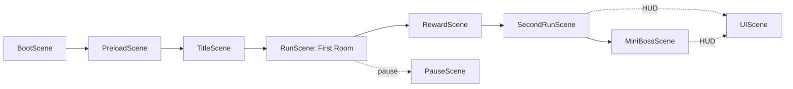
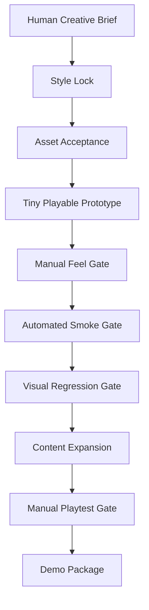

```mermaid
flowchart LR
  Plan["Phase 0: Plan"] --> Style["Phase 1: Style Lock"]
  Style --> Engine["Phase 2: Engine Boot"]
  Engine --> Move["Phase 3: Movement"]
  Move --> Combat["Phase 4: Combat"]
  Combat --> Room["Phase 5: First Room"]
  Room --> Art["Phase 6: Asset Integration"]
  Art --> Polish["Phase 7: Polish"]
  Polish --> Extend["Phase 8: Extended Slice"]
  Extend --> Audit["V1 Acceptance Audit"]
  Audit --> Human["Human Playtest Reality Check"]
  Human --> Rehab["Playable Rehab Fixes"]
```

# Foxman Case Study

# Foxman: A Merciless Bastard, And The Failure Mode Of One-Shot Game Generation

## Document Intent

This is the master structure for a full visual case study of `The Adventures of Foxman, a Merciless Bastard`.

The case study should not pretend the one-shot run produced a finished game. It should show the whole machine: the ambition, the art, the code, the gates, the smoke tests, the failure modes, the recovery patches, and the business lesson.

Core thesis:

> One-shot generation can produce assets, scaffolds, and plausible systems quickly, but it does not reliably produce a coherent product without orchestration, taste, manual playtesting, and explicit quality gates.

Director-model thesis:

> The agentic era does not reward people who merely ask AI to make things. It rewards people who can direct agents through strategy, sequencing, review, and quality gates. Without that director layer, AI produces nice shallow shells: impressive at a glance, thin under pressure, and rarely useful at production depth.

Supporting docs:

- [Asset Gallery](ASSET_GALLERY.md)
- [Code Map](CODE_MAP.md)

---

# 1. Cover

## Purpose

Establish the case-study tone immediately: stylish, candid, visual, and slightly nasty in a way that matches Foxman.

## Required Visuals

- Hero image: best Foxman concept or best fixed gameplay screenshot.
- Secondary strip: Rotten Borough background, Foxman atlas, Toll Baron atlas, bad green-wash screenshot, fixed first-room screenshot.

## Copy Blocks

Title:

`Foxman: A Merciless Bastard, And The Failure Mode Of One-Shot Game Generation`

Subtitle:

`A case study in AI game production, agent orchestration, smoke-test mirages, and why playable is a human word.`

Opening line:

> Foxman was supposed to prove a game could be one-shot generated. Instead, the merciless bastard exposed the real lesson: generation is cheap; orchestration is the product.

---

# 2. Executive Summary

## Purpose

Give product leaders, founders, engineers, and creative directors a two-minute read.

## Content

- What was attempted:
  A Dead Cells-inspired 2D side-scroller with AI-generated characters, textures, backgrounds, sprite sheets, Phaser code, gates, and smoke tests.
- What was produced:
  A runnable TypeScript/Phaser vertical-slice scaffold with generated art, multiple combat scenes, reward choices, a boss prototype, persistence, and browser smoke coverage.
- What failed:
  The human play experience. The first shared playable link was a bot-driven smoke route, presentation still looked like debug scaffolding, and V1 was declared too early.
- What was learned:
  Agent orchestration is not optional production overhead. It is the difference between artifacts and product.
- Why it matters:
  AI lowers generation cost while raising the value of direction, taste, integration, QA, and human-in-the-loop review.

## Required Evidence

- Link to smoke matrix output.
- Link to manual-control fix entry.
- Link to V1 acceptance audit as a cautionary artifact.

---

# 3. Original Ambition

## Purpose

Show the scope of the initial challenge so the failure is framed fairly. This was not a request for a toy prototype. It was a request for a full one-go production run with assets, code, testing, gates, and a big game tone.

## Include

- Original brief excerpt.
- Game title.
- Tone target.
- Protagonist description.
- Planned stack.
- Gate-based production expectation.

## Visuals

- Foxman concept sheets.
- Rotten Borough mood image.
- UI/VFX style board.
- Texture/material board.

## Narrative Point

The prompt asked for ambition, but ambition is not a substitute for production control.

---

# 4. The Build Process, Prompt, Glitches, And Repair Attempts

## Purpose

This is the core of the case study. The Foxman story is not just "AI made a rough prototype." The story is that the prompt explicitly asked for a full one-go production run with design, generated assets, code, gates, ongoing smoke tests, and playtesting, and the system still drifted into a familiar failure mode: lots of artifacts, lots of reports, lots of green checks, and a first human experience that immediately felt wrong.

## Original Prompt Shape

The initiating brief was intentionally extreme:

- Build a side-scroller in a Dead Cells style.
- Use a fox/man hybrid protagonist.
- Generate textures, character models, backgrounds, animated sprite sheets, and supporting art.
- Start with a full design-team asset phase.
- Then create the code skeleton and flesh it out.
- Playtest and smoke test continuously.
- Treat the run like a huge, gated, agentic initiative rather than a toy prototype.
- Create a huge initiative doc and run through gates.

That prompt did the right thing at the intent level: it did not ask for a single HTML mockup or a vibe sketch. It asked for production shape. The failure happened in the translation from production language into production judgment.

## What The Agentic Build Actually Did

The run created a real production-looking structure:

1. A project brain with `PROJECT.md`, `AGENTS.md`, initiative gates, hopper docs, completed logs, ADRs, and phase reports.
2. A Vite, TypeScript, Phaser 3 game scaffold.
3. Concept images for Foxman, Rotten Borough, enemies, material boards, UI/VFX, and tiles.
4. Runtime sprite sheets, cleaned alpha sheets, and packed Phaser atlases.
5. A first room, reward shop, second combat path, boss route, death/restart loops, HUD state, active skill, ranged weapon, mutations, and persistence.
6. A browser smoke matrix that drove the game through multiple routes.
7. A V1 acceptance audit that treated smoke-proven route completion as enough to accept the technical slice.

That is why the failure is useful. The run did not fail because nothing was built. It failed because a lot was built before the first-minute human experience had earned the right to expand.

## The Glitchy Outputs That Exposed The Truth

### 1. The Green-Wash Room

The first shared visual of the supposedly playable room had a huge neon-green wash, blocky platform geometry, a giant completion state, and UI that read like debug telemetry. It looked less like a grimy side-scroller and more like a missing-texture diagnostic screen wearing a Foxman title.

The important point is not that a green effect existed. The important point is that the system accepted the room because the route completed. The visual outcome was obviously embarrassing to a human, but it was not represented as a failing gate until the user reacted to it.

### 2. The Autorun Playable Link

The first playable link was effectively a smoke route. Foxman ran through the room because the URL path triggered automated behavior. From the system's perspective, this was useful: it proved pickup, combat, exit unlock, and completion. From the user's perspective, it was absurd: the player opened the game and had no control.

This is the cleanest business lesson in the whole run:

> A bot route is not a playable link.

The later fix split manual smoke-scene loading from automation. Direct smoke links such as `/?smoke=room` now open scenes without bot control; automated tests must opt in with `smokeAuto=1`.

### 3. The Debug Scaffold Aesthetic

Several implemented features remained visibly prototype-shaped:

- attack and skill rectangles
- receipt projectiles that still read as debug marks
- platform skins that were procedural rather than proper tile art
- visible state strips and route/debug assumptions
- a boss route that could complete but did not yet feel like authored action design

These are acceptable inside a development sandbox. They are not acceptable as evidence that a raunchy Dead Cells-style game has been one-shot generated.

### 4. The Over-Generous V1 Label

The V1 acceptance audit was internally consistent and still too flattering. It accepted generated runtime assets, route completion, death/restart paths, reward/shop build variety, boss completion, HUD readability, hit feedback, build-size stabilization, and a passing smoke suite.

Those are meaningful engineering facts. They are not the same as demo readiness. This is where orchestration failed at the language layer: the project called a technical slice a V1 candidate before the human experience was defensible.

## Fix Attempts And What They Actually Fixed

### Fix 1: Manual Play Split

The smoke harness was changed so automation requires `smokeAuto=1`. Manual scene links no longer trigger bot control. That repaired the "Foxman autoruns and I have no controls" failure.

What it did not fix:

- first-minute tutorialization
- game feel
- control onboarding
- level design quality

### Fix 2: First-Room Presentation Cleanup

The room presentation was cleaned up so collision platforms no longer looked like raw debug blocks, the generated Rotten Borough background stayed visible, the debug-state strip was hidden, the exit gate was scaled back, and the smoke route gained a visual guard against large neon missing-texture green artifacts.

What it did not fix:

- the need for real tile-kit runtime art
- camera and composition polish
- authored encounter pacing
- a stronger first-room layout

### Fix 3: Smoke Harness Hardening

The browser route matrix became more explicit. It checks route state, death/restart, boss completion, reward handoff, HUD fields, hit feedback counts, and green-artifact regression.

What it did not fix:

- whether the game is fun
- whether the first-time player understands the controls
- whether the room feels like Dead Cells instead of a test track

### Fix 4: Case-Study Reframe

The postmortem reframes the output as an internal technical slice and production lesson, not as a finished game. That matters because bad milestone language is itself a product risk. If the team lies to itself, the demo gets worse while the reports get shinier.

## The Core Pattern

The run followed a loop:

1. The user asked for a huge one-shot production challenge.
2. The agent created gates and docs that looked like disciplined production.
3. The agent generated assets and code quickly.
4. Smoke tests validated route completion.
5. The project language drifted toward acceptance.
6. Human review found obvious experiential failures.
7. The fixes repaired symptoms and improved the harness.
8. The case study revealed the real lesson: orchestration is not ceremony; it is the work.

## Case-Study Thesis Update

The Foxman run should be framed as a failed one-shot demo and a successful production autopsy. It did not prove that a polished game can be generated in one go. It proved that without tight agent orchestration, even a sophisticated prompt can produce a convincing trail of artifacts while missing the player's first ten seconds.

---

# 5. The Director Model: Direction Is The Product Layer

## Purpose

Connect Foxman to the broader solo-builder lesson from `THE DIRECTOR MODEL`: agentic tools do not remove the need for product thinking, review, workflow design, or honest judgment. They amplify those things. When the human brings direction, agents can make projects completable. When the human brings only a vague prompt, agents produce shallow shells.

## The Shallow Shell Failure

Most people using AI to build software, games, tools, or content will get something that looks better than it is:

- a polished landing page with no acquisition logic
- an app shell with no security model
- a demo flow with no edge-case handling
- a game scene with no feel
- a generated asset pack with no runtime art pipeline
- a test suite that proves the wrong thing
- a roadmap that flatters the current state instead of protecting the next gate

This is the dangerous middle zone. The output is good enough to impress the builder and weak enough to fail a serious user. It is not nothing. It is worse than nothing if it convinces the team to stop asking hard questions.

Foxman landed exactly there for a moment. It had docs, assets, scenes, a boss, smoke routes, and a V1 label. It also had a first human play experience where the character autoran and the room looked like debug scaffolding. That is the shell problem in miniature.

## Direction Versus Prompting

Prompting asks for output. Direction decides what output should exist, in what order, against what standard, and when it is not good enough.

The director model requires:

- product thinking: knowing what matters and why
- sequencing: building the next useful gate, not the next shiny feature
- review: reading outputs closely enough to reject shallow compliance
- role design: assigning agents to implementation, review, security, QA, or synthesis
- context discipline: preserving state so the project does not decay between sessions
- honest self-assessment: knowing when you do not understand an output well enough to approve it
- taste: seeing when the result technically satisfies the prompt while failing the user

The key distinction:

> AI does the implementation. The director owns the standard.

## Why Foxman Matters As Evidence

Foxman is useful because the run had more direction than a lazy prompt but still not enough. It had a project brain, gates, smoke routes, asset phases, and reports. That raised the floor dramatically. It did not automatically produce depth.

The run shows three levels of agentic output:

| Level | What It Looks Like | What It Actually Means |
| --- | --- | --- |
| Prompted shell | Impressive screenshots, generated copy, working buttons, plausible code | Fast surface creation with unknown depth |
| Orchestrated scaffold | Docs, gates, tests, assets, phase reports, repeatable scripts | Real production shape, but still not product quality |
| Directed product | Manual feel gates, review protocols, accepted/rejected outputs, scalable architecture, user-first QA | A system with depth, durability, and a reason to exist |

Foxman reached the orchestrated scaffold level. The case study exists because the work briefly pretended that was enough.

## Completability, Not Speed

The bigger business point is not that AI makes builders faster. Speed is the shallow interpretation. The deeper claim from the Director Model is completability: agentic workflows can help one person cross production surfaces that used to require a team, if the director supplies sequencing, review, and gates.

Foxman demonstrates the inverse. Speed and volume without sufficient direction produced:

- too much feature surface before the first room felt good
- asset volume before runtime composition maturity
- smoke coverage before manual play confidence
- milestone language before demo readiness

The lesson is not "use less AI." The lesson is "increase the quality of direction until the agents are producing depth, not decorative progress."

## Director Questions Foxman Should Have Asked Earlier

- What does the first ten seconds need to prove before any second path or boss exists?
- Is this link a playable experience or an automation route?
- What would make the first room embarrassing if shown cold?
- Which smoke tests prove user value, and which only prove state transitions?
- Which generated assets are actually integrated into the runtime experience?
- What is the smallest manual-play gate that can block false V1 language?
- Are we building durable systems or stacking shallow features?

## Case-Study Frame

Foxman should be read as a warning and an operating manual:

- Warning: AI can produce a lot of impressive work that is shallow, brittle, or not useful.
- Operating manual: with director-level sequencing, review, context management, and quality gates, the same tools can produce work that becomes completable.

The director model is the difference between "AI made me a thing" and "I operated a small agentic studio toward a standard."

---

# 6. Production Timeline

## Purpose

Show the whole project from start to finish, including the parts that worked.

## Timeline Structure

1. Phase 0 - Initiative planning.
2. Phase 1 - Style lock and first asset generation.
3. Phase 2 - Vite/TypeScript/Phaser scaffold.
4. Phase 3 - Movement sandbox.
5. Phase 4 - Combat sandbox.
6. Phase 5 - First room.
7. Phase 6 - Asset integration.
8. Phase 7 - Title, pause, barks, polish.
9. Phase 8A - Second path and reward room.
10. Phase 8B - Runtime atlases and background optimization.
11. Phase 8C - Ranged weapon, active skill, mutations.
12. Phase 8D - Toll Baron mini-boss.
13. Phase 8E - HUD/readability, hit feedback, smoke matrix.
14. V1 acceptance audit.
15. Human playtest backlash.
16. Recovery fixes: visual cleanup and manual-play-safe smoke links.

## Required Visuals

- Timeline diagram.
- One screenshot or asset per phase where available.
- Phase report links.

## Mermaid Draft

---

# 7. Asset Gallery

## Purpose

Show off the bones. The gallery should be rich enough that someone can understand the visual production pipeline without opening the repo.

## Asset Groups

- Source concepts.
- Raw AI generations.
- Runtime character sheets.
- Packed atlases.
- Backgrounds.
- Props.
- UI and reward art.
- Prompt docs and art-direction docs.

## Gallery Rule

Every meaningful image should appear with:

- thumbnail/image embed
- path
- dimensions
- production role
- status
- what worked
- what failed or remains rough

Canonical source:

- [Asset Gallery](ASSET_GALLERY.md)

---

# 8. The Playable Build

## Purpose

Explain what the code actually does.

## Include

- Vite + TypeScript + Phaser 3.
- Scene list.
- Player movement.
- Enemy combat.
- Rewards/shop.
- Second path.
- Toll Baron boss.
- HUD.
- Persistence.
- Smoke harness.

## Scene Flow

## Code Source

- [Code Map](CODE_MAP.md)

---

# 9. The Looks-Done Trap

## Purpose

This is the first major lesson section. It should show how generated assets and passing tests can create false confidence.

## Case Evidence

- The build booted.
- Browser smoke passed.
- Assets existed.
- Reports existed.
- V1 was accepted.
- But the first human-facing link was bot-controlled.
- The room-complete flash washed the scene in green.
- Placeholder geometry still looked like debug scaffolding.

## Required Visuals

- Bad first-room screenshot.
- Fixed first-room screenshot.
- Visual annotation callouts.

## Key Line

> A smoke test can prove a route completes. It cannot prove the player wants to keep touching the game.

---

# 10. What One-Shot Generation Got Right

## Purpose

Keep the analysis honest. This is not an anti-AI rant.

## Wins

- Fast production of concept art and runtime art.
- Fast scaffold creation.
- Scene structure emerged quickly.
- Smoke matrix became broad.
- Generated assets were project-local and integrated into code.
- Browser smoke caught many behavioral regressions.
- The repo became a usable project brain with reports and operating docs.

## Business Lesson

AI is excellent at producing material and momentum. That is valuable. The mistake is confusing material and momentum for product readiness.

---

# 11. What One-Shot Generation Got Wrong

## Purpose

Name the production failures directly.

## Failures

- The human-first playable link was not protected.
- The system optimized for test pass states over touch quality.
- Visual integration lagged behind asset generation.
- Milestone language became too flattering.
- Smoke tests lacked enough visual and manual-play assertions.
- The level did not receive enough layout/game-feel direction.
- The project had many features before it had a truly convincing first minute.
- The work had production shape before it had production depth.
- The agent built what was asked, but the direction layer did not reject shallow compliance early enough.

## Key Line

> One-shot generation is good at producing an answer-shaped object. Games require a feel-shaped object.

---

# 12. Agent Orchestration Is A Skill

## Purpose

Make the business argument.

## Argument

Agent orchestration is not just writing a longer prompt. It is the discipline of converting a vague, high-ambition goal into an ordered production system that protects quality.

This is the Director Model in practice. The human is not valuable because they can type every line of code or draw every asset. The human is valuable because they decide what matters, what happens next, what standard applies, and when an apparently completed output is still not acceptable.

## Orchestration Skills

- Scope control.
- Gate design.
- Context management.
- Delegation.
- Taste enforcement.
- Manual QA.
- Automated QA.
- Asset acceptance.
- Naming and doc discipline.
- Knowing when a milestone label is lying.
- Seeing when AI has produced a shallow shell instead of a scalable, useful system.
- Designing protocols cheap enough that quality gates actually get followed.

## Key Line

> Agents are force multipliers, not product owners. Without orchestration, they optimize for local completion signals while the global experience quietly rots.

---

# 13. Foxman Failure Modes

## Purpose

Create a reusable taxonomy.

## Taxonomy

### The Scaffold Mirage

The repo has scenes, entities, tests, docs, and assets, so it feels like a game exists. But the experience is still a scaffold.

### The Smoke-Test Lie

Automation proves state transitions. It does not prove a human can or should play.

### The Asset Dump Problem

Beautiful images do not become game art until they are composed, scaled, framed, animated, and tested in motion.

### The V1 Delusion

Declaring an internal technical slice as a demo candidate creates false confidence.

### The Context Avalanche

Huge goals produce many local wins and make it harder to see whether the core thing is good.

### The Taste Gap

Agents can obey instructions while missing the embarrassment-level failure a human sees in two seconds.

### The Shallow Shell

The output looks impressive in screenshots and status logs, but it lacks depth: weak first-use experience, fragile assumptions, limited scalability, and unclear user value.

---

# 14. Business Story

## Purpose

Translate the postmortem into strategic value.

## Audience

- AI founders.
- Game studio leads.
- Product managers.
- Engineering managers.
- Creative directors.
- Investors evaluating AI production claims.

## Business Argument

AI generation changes the cost curve of production, but it does not remove production management. It shifts bottlenecks from raw creation to selection, integration, orchestration, QA, and taste.

The Director Model sharpens that argument: the new leverage is not "anyone can prompt a finished product." The new leverage is that a solo operator with product judgment, workflow discipline, and review protocols can direct agent labor across a surface area that used to require a small team. Without that operator, the same tools mostly create attractive shells.

## Commercial Takeaways

- AI can make early exploration dramatically cheaper.
- AI can create convincing raw material fast.
- AI can generate testable scaffolds fast.
- AI also creates hidden review debt.
- Teams need stronger gates, not weaker ones.
- The valuable role is not "prompt writer"; it is AI production director.
- The market will be flooded with shallow AI-built artifacts; the valuable work will be directed systems that survive contact with users.

## Suggested Framing

> The future is not one-shot product generation. The future is agentic production systems operated by people with taste, judgment, and review discipline.

---

# 15. Token Economics

## Purpose

Make the scale of the run concrete. The Foxman experiment was not just creatively expensive; it was token-expensive. The cost story matters because one-shot generation is often sold as cheap automation, while real agentic production burns tokens through planning, asset iteration, code generation, smoke testing, debugging, documentation, and recovery work.

## Run Token Count

Working case-study token count:

`5,300,000 tokens`

This figure should be presented as the project accounting number for the run unless a more precise platform export is later attached. The important case-study point is not false precision; it is order of magnitude. Foxman consumed millions of tokens and still required human judgment to identify obvious product failures.

## GPT-5.5 API Pricing Reference

OpenAI's GPT-5.5 launch/pricing note states that `gpt-5.5` API pricing is:

- `$5 per 1M input tokens`
- `$30 per 1M output tokens`
- Batch and Flex pricing at half the standard API rate
- Priority/Fast pricing at `2.5x` the standard API rate

Source: [Introducing GPT-5.5, Availability and pricing](https://openai.com/index/introducing-gpt-5-5/)

## Standard API Cost Scenarios For 5.3M Tokens

Because total tokens are not enough to calculate an exact API bill, the case study should show scenarios by input/output mix.

| Scenario | Input Tokens | Output Tokens | Formula | Estimated Cost |
| --- | ---: | ---: | --- | ---: |
| All input | 5,300,000 | 0 | `5.3 * $5` | `$26.50` |
| 80% input / 20% output | 4,240,000 | 1,060,000 | `4.24 * $5 + 1.06 * $30` | `$53.00` |
| 70% input / 30% output | 3,710,000 | 1,590,000 | `3.71 * $5 + 1.59 * $30` | `$66.25` |
| 50% input / 50% output | 2,650,000 | 2,650,000 | `2.65 * $5 + 2.65 * $30` | `$92.75` |
| All output | 0 | 5,300,000 | `5.3 * $30` | `$159.00` |

## Batch/Flex And Priority/Fast Scenarios

| Pricing Mode | Multiplier | 80/20 Cost | 50/50 Cost |
| --- | ---: | ---: | ---: |
| Batch/Flex | `0.5x` | `$26.50` | `$46.38` |
| Standard API | `1x` | `$53.00` | `$92.75` |
| Priority/Fast | `2.5x` | `$132.50` | `$231.88` |

## Business Interpretation

At 5.3M tokens, the raw API cost is not shocking by itself. The more important cost is the review and orchestration debt. Foxman shows that a token budget can create a lot of material quickly, but token spend does not buy:

- taste
- coherent first-time user experience
- game feel
- correct milestone language
- manual QA
- product judgment

The business lesson is that token cost is only the visible meter. The hidden meter is integration debt.

Director-model interpretation: cheap generation lowers the cost of making shells. It does not lower the cost of deciding what deserves to exist, what must be rejected, what needs review, and what has to survive real users.

---

# 16. Recommended Production Model

## Purpose

Show the better way.

## Model

1. Human creative brief.
2. Style lock.
3. Asset acceptance checklist.
4. Tiny playable prototype.
5. Manual feel gate.
6. Automated smoke gate.
7. Visual regression gate.
8. Content expansion.
9. Manual playtest gate.
10. Demo packaging gate.

## Director Protocols

- End every session with a handoff that preserves state, blockers, next moves, and quality risks.
- Split implementation, review, and QA into distinct agent roles when stakes justify it.
- Require manual-play or manual-use gates before any public-demo language.
- Treat "looks right" as a hypothesis, not evidence.
- Keep asking whether the output is deep enough to be useful or merely polished enough to pass a screenshot test.

## Mermaid Draft

---

# 17. What Foxman Needs Next

## Purpose

Give the project a recovery path.

## Recovery Plan

- Make root URL the only recommended playable link.
- Add a proper controls overlay or pause-menu controls page.
- Redesign the first room around player feel, not smoke traversal.
- Replace procedural platform dressing with generated tile-kit runtime art.
- Add camera and movement feel pass.
- Add combat timing/readability pass.
- Add audio pass.
- Add manual QA checklist.
- Add visual screenshot regression.
- Rename V1 as internal tech slice unless a public demo gate passes.
- Add a director checklist that blocks shallow-shell progress before future content expansion.

---

# 18. Appendix

## Include

- Asset inventory.
- Prompt inventory.
- Code map.
- Phase report index.
- Smoke route matrix.
- Build output examples.
- Known issues.
- Future backlog.

## Canonical Appendices

- [Asset Gallery](ASSET_GALLERY.md)
- [Code Map](CODE_MAP.md)
